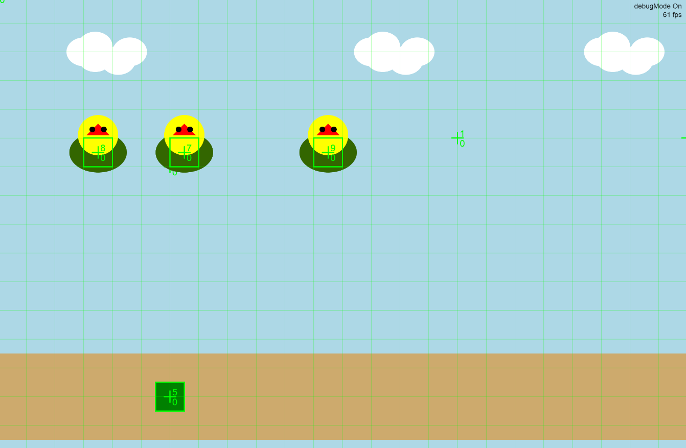

# Javascript Game 

Hier zie je een game die we zelf moesten maken aan de hand van javascript.

Ik heb ervoor gekozen om soort van canongame te maken waarbij je vogels uit de lucht moet schieten.Je kan dan bewegen met pijltjes van links naar rechts en het bovenste pijltje zorgt ervoor dat je kan schieten.

