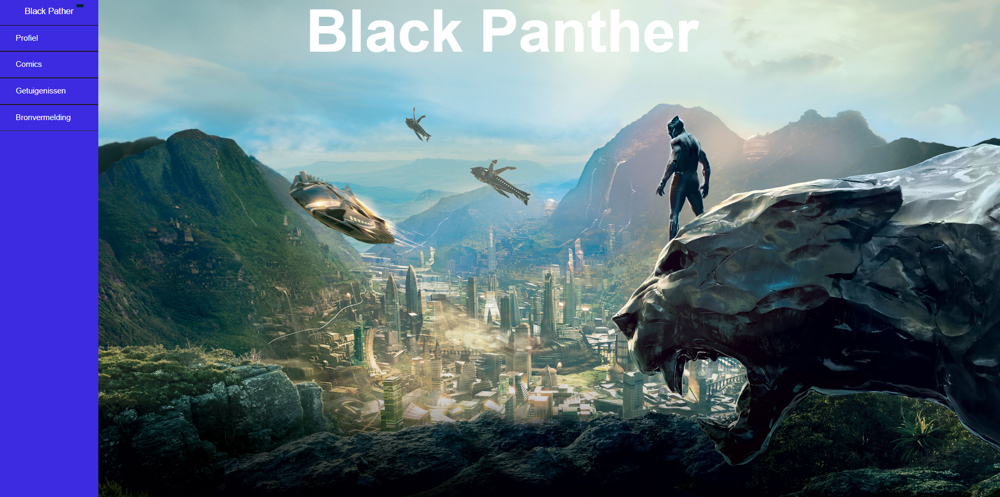
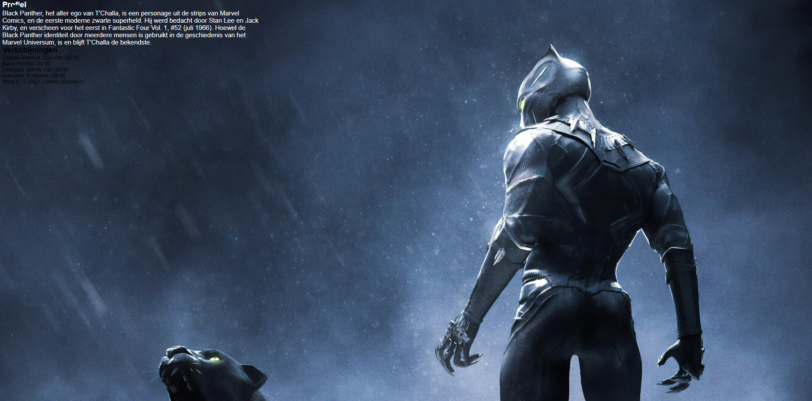
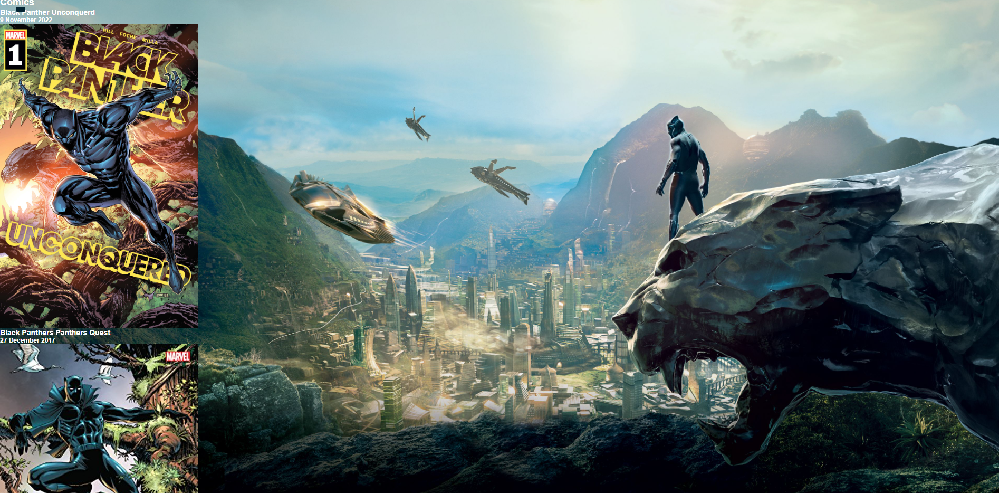
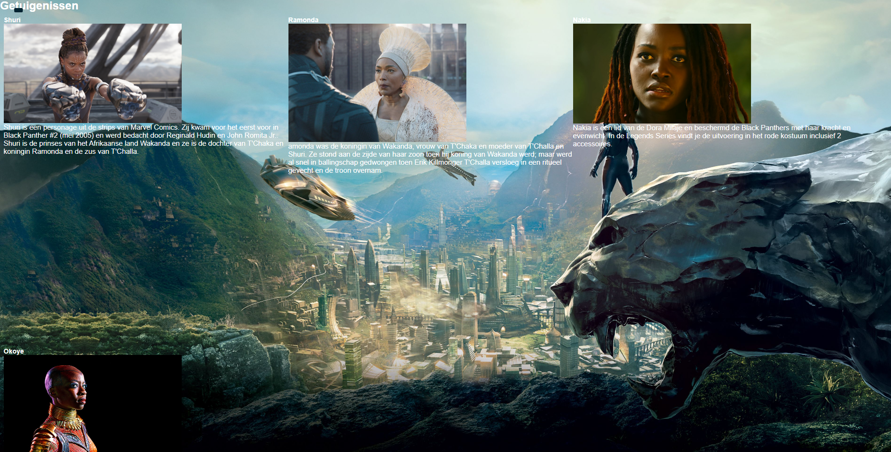
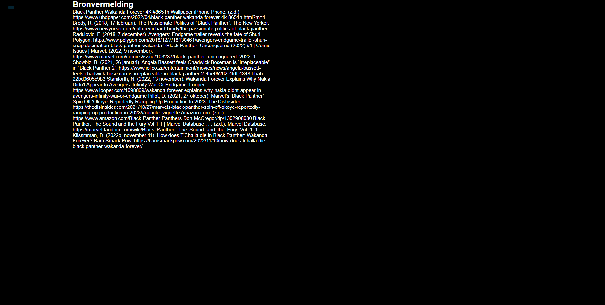

# Webstie SuperHero 

Bij deze opdracht was het de bedoeling om een website te maken over een superheld naar keuzen. We moesten gebruik maken van css en html wat is best wel leuk vondt om te doen.

Hierbij geef ik nog wat uitleg bij mijn website zelf. 

 Hier zie je mijn start pagina waar je kan gebruik maken van de side bar. Die ook weer weg geklikt kan worden 

Als je dan door klikt naar profiel zie je dat ik dieper in ga wie black Panther nu eigenlijk is

Nu zijn we bij het deel comics. Het was de bedoeling om 3 comics te kiezen van de black panther en er de naam en datum bij te zetten. Je kan dan naar beneden scrollen voor de derde te kunnen bekijken. Daar heb ik gebruik gemaakt van de display flex functie. 

 Hier moesten we 4 personages kiezen die iets te maken hadden met black panther. Ik heb dan gekozen voor Shuri,Ramonda,Nakia en Okoye. 

 Als was het verplicht om je bronnen te vermelden want ander zou het plagiaat zijn. Ik heb dan mijn bronnen officieel vermeld.  
